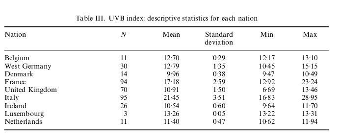
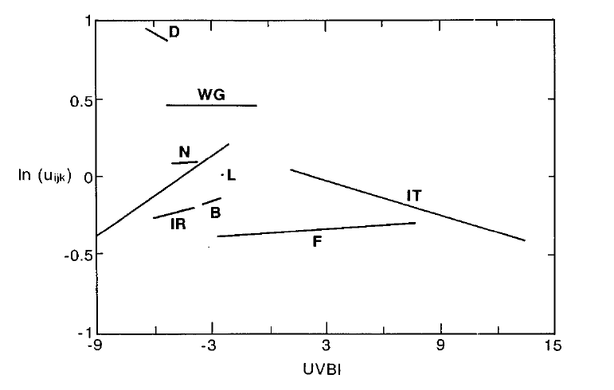

```{r setup, include=FALSE}
knitr::opts_chunk$set(echo = FALSE)
knitr::opts_chunk$set(cache = TRUE)
knitr::opts_chunk$set(message=FALSE)
knitr::opts_chunk$set(warning = FALSE)
library(tidyverse)
library(gridExtra)
library(mlmRev)
library(GGally)
library(rstanarm)
library(bayesplot) 
library(loo)
library(caret)
library(rstan)
library(knitr)
library(loo)

data = Mmmec
set.seed(pi)
#recompute stan models?
recompute=FALSE


#function for loo from stan model
custom_loo = function(fitted_stan_model){
  log_lik_slopes = extract_log_lik(fitted_stan_model)
  loo_slopes <- loo(log_lik_slopes)
  return(loo_slopes)
}

```
# Project aim and description
In this project I studied the relationship between UVB radiation and melanoma mortality rate. Additionaly a comparison with the following paper has been performed:
<blockquote>
<p>Langford, I.H., Bentham, G. and McDonald, A. (1998). Multilevel modelling of geographically aggregated health data: a case study on malignant melanoma mortality and UV exposure in the European community. <em>Statistics in Medicine</em>, <em>17</em>, 41-58.</p>
</blockquote>

# Dataset description

This dataset describes the mortality rate of malignent melanoma in eight European countries.
The reference is the following: 

<blockquote>
https://www.rdocumentation.org/packages/R2MLwiN/versions/0.8-6/topics/mmmec
</blockquote>

There is a total of six variables and 354 observations:
<ul>
<li><code>nation</code> a factor with levels <code>Belgium</code>, <code>W.Germany</code>, <code>Denmark</code>, <code>France</code>, <code>UK</code>, <code>Italy</code>, <code>Ireland</code>, <code>Luxembourg</code>, and <code>Netherlands</code></li>
<li><code>region</code> Region ID - a factor</li>
<li><code>county</code> County ID - a factor</li>
<li><code>deaths</code> Number of male deaths due to malignant melanoma during 1971-1980*</li>
<li><code>expected</code> Number of expected deaths (proportional to population)</li>
<li><code>uvb</code> Centered measure of the UVB dose reaching the earth’s surface in each county.**</li>
</ul>

```* for the United Kingdom,
Ireland, Germany, Italy and The Netherlands, data were only available from 1975—1976 onwards ```

```** in the paper the measure is not centered```

The data are geographically nested, since nations are divided in regions, and regions are divided in counties. 
A county is the smallest area forwich we have data.

Here is a schema of the nesting:

And relative counts:
```{r counting elements}
kable(data%>%group_by(nation)%>%summarise(regions=n_distinct(region),counties=n_distinct(county)),caption = "Data hierarchy")
```

# EDA

```{r descriptive statistics for centered UVB variable }


p1 = ggplot(data,aes(x=nation,y=uvb))+
  geom_boxplot()+
  ggtitle("Uvb by nation")+
  theme(axis.text.x = element_text(angle = 90, hjust = 1))

p2 = ggplot(data,aes(x=nation,y=deaths))+
  geom_boxplot()+
  ggtitle("Deaths by nation")+
  theme(axis.text.x = element_text(angle = 90, hjust = 1))

grid.arrange(p1, p2, ncol=2)

ggplot(data,aes(x=deaths))+
  geom_histogram()+
  #facet_grid(nation ~ .)+
  ggtitle("Deaths count")

kable(data%>%group_by(nation)%>%summarise(N=n(),mean=mean(uvb),sd = sd(uvb),min=min(uvb),max=max(uvb)),caption="Descriptive statistics for UVB",digits = 2)
```

As we can see from a comparison with Table 3 of the paper the values are not the same, since they used a non centered parametrization.


## Correlation plots
```{r correlation}
dataReduced = data %>%select(-c(nation,region,county))
ggpairs( dataReduced ) 
```

# Modelling
The model proposed is a doubly nested negative binomial model, two models are presented: model A and model B, they reflect the models of the paper but with a negative binomial instead of a Poisson distribution.
The nesting is performed on nations, and for every nation on the regions.

## model A:
$$count_{ijk}=NB(ln(O_{ijk}),\phi)$$
$$ln(O_{ijk}) = ln(E_{ijk})+\alpha+\beta*UVB_{ijk} +s_k+u_{jk}+e_{ijk}$$
$$s_k\sim N(0,\sigma^2_{s}) $$
$$u_{jk}\sim N(0,\sigma^2_{u}) $$

## model B:

$$ln(O_{ijk}) = ln(E_{ijk})+\alpha+\beta*UVB_{ijk} +s_k +$$
$$ + t_k*UVB_{ijk} + u_{jk} + v_{jk}*UVB_{ijk} + e_{ijk})$$
$$s_k\sim N(0,\sigma^2_{s}) $$

$$t_{k}\sim N(0,\sigma^2_{t}) $$

$$u_{jk}\sim N(0,\sigma^2_{u}) $$
$$v_{jk}\sim N(0,\sigma^2_{v}) $$

explanation of the symbols:

- $i$ represents a county, $j$ represents a region and $k$ represents a nation.
- $E_{ijk}$ is the exposure given in the dataset
- $s_k$,$t_k$  the variations at national level
- $u_{jk}$,$v_{jk}$are  the variations at regional level nested in nations
- $e_{ijk}$ is the randdom variation at county level


## Stan code used for model B:
```{r model implementation}
modelB_priors=readRDS("models/modelB_priors.stanModel")
code <- get_stancode(modelB_priors)
cat(code)
```


```{r model comparison}
#import models
modelA=readRDS("models/modelA.stanModel")
modelB=readRDS("models/modelB.stanModel")
modelB_priors=readRDS("models/modelB_priors.stanModel")


if(recompute){
  #preparing data transforming factors in integers
  data2=data
  groupingL3=data$nation
  groupingL2=data$region
  groupingL1=data$county
  data2$region_id = as.integer(factor(data$region, levels = unique(data$region)))
  data2$nation_id = as.integer(factor(data$nation, levels = unique(data$nation)))
  nationLookupVec <- as.integer(unique(data2[c("region","nation")])[,"nation"])

  stan_data =
    with(data2,
         list(
              N = length(deaths),
              L = length(unique(groupingL2)),
              J = length(unique(groupingL3)),
              deaths = deaths,
              uvb = uvb,
              population = log(expected),
              region_id = region_id,
              nation_id = nation_id,
              nationWithinRegion = nationLookupVec 
              )
         )
  model_b_stan_priors = rstan::stan_model("models/modelB_priors.stan")
  fitted_b_stan_priors <- rstan::sampling(model_b_stan_priors,
                                   data = stan_data,
                                   chains = 4, 
                                   cores = 4,
                                   iter = 4000, 
                                   control = list(adapt_delta = 0.80, max_treedepth=10),verbose=TRUE,seed=4)

  modelB_priors=fitted_b_stan_priors
  saveRDS(modelB_priors,"models/modelB_priors.stanModel")
  
   model_b_stan = rstan::stan_model("models/modelB.stan")
  fitted_b_stan <- rstan::sampling(model_b_stan,
                                   data = stan_data,
                                   chains = 4, 
                                   cores = 4,
                                   iter = 4000, 
                                   control = list(adapt_delta = 0.80, max_treedepth=10),verbose=TRUE,seed=4)

  modelB=fitted_b_stan
  saveRDS(modelB,"models/modelB.stanModel")
  
    model_a_stan = rstan::stan_model("models/modelA.stan")
  fitted_a_stan <- rstan::sampling(model_a_stan,
                                   data = stan_data,
                                   chains = 4, 
                                   cores = 4,
                                   iter = 4000, 
                                   control = list(adapt_delta = 0.80, max_treedepth=10),verbose=TRUE,seed=4)

  modelA=fitted_a_stan
  saveRDS(modelA,"models/modelA.stanModel")
  
}

loo_A  = custom_loo(modelA)
loo_B  = custom_loo(modelB)
loo_B_priors  = custom_loo(modelB_priors)
print(loo_compare(loo_A,loo_B,loo_B_priors)) #model B wins

#std residuals modelA

#modelA
y_rep = as.matrix(modelA, pars = "y_rep")
y_rep_values = y_rep[1:length(data$deaths),]
mean_inv_phi <- mean(as.matrix(modelA, pars = "inv_phi"))
mean_y_rep <- colMeans(y_rep)
std_resid <- (data$deaths - mean_y_rep) / sqrt(mean_y_rep + mean_y_rep^2*mean_inv_phi)
plotData=data.frame(data,std_resid,mean_y_rep)
ggplot(plotData,aes(x=mean_y_rep,y=std_resid,color=nation))+
  geom_point()+
  geom_hline(yintercept = 2,color="red")+
  geom_hline(yintercept = -2,color = "red")+
  geom_hline(yintercept = 3,color="green")+
  geom_hline(yintercept = -3,color = "green")+
  ggtitle("Std residuals for model A ")

#modelB
y_rep = as.matrix(modelB, pars = "y_rep")
y_rep_values = y_rep[1:length(data$deaths),]
mean_inv_phi <- mean(as.matrix(modelB, pars = "inv_phi"))
mean_y_rep <- colMeans(y_rep)
std_resid <- (data$deaths - mean_y_rep) / sqrt(mean_y_rep + mean_y_rep^2*mean_inv_phi)
plotData=data.frame(data,std_resid,mean_y_rep)
ggplot(plotData,aes(x=mean_y_rep,y=std_resid,color=nation))+
  geom_point()+
  geom_hline(yintercept = 2,color="red")+
  geom_hline(yintercept = -2,color = "red")+
  geom_hline(yintercept = 3,color="green")+
  geom_hline(yintercept = -3,color = "green")+
  ggtitle("Std residuals for model B ")


#posterior checks model A
if(FALSE){
  fit_A = as.matrix(modelA)
  paper_results=data.frame(var_nat=0.105,var_reg=0.0147)
  mcmc_areas(fit_A,regex_pars = "var",prob = 0.95)+
    geom_vline(data = paper_results, xintercept = paper_results$var_nat ,color="green")+
    geom_vline(data = paper_results, xintercept = paper_results$var_reg,color="red")+
    annotate("text", x = paper_results$var_nat, y = 1.5, label = "var_nat paper")+
    annotate("text", x = paper_results$var_reg, y = 1.8, label = "var_reg paper")
  
  mcmc_intervals(fit_A,pars = "alpha")
  mcmc_intervals(fit_A,regex_pars = "sigma")
  mcmc_intervals(fit_A,regex_pars = "^alpha_nat")
  mcmc_intervals(fit_A,regex_pars = "^alpha_reg")
  
  list_of_draws=extract(modelA)
  dev=data.frame(
    alpha=mean(list_of_draws$alpha),
    alpha_sd=sd(list_of_draws$alpha),
    beta=mean(list_of_draws$beta),
    beta_sd=sd(list_of_draws$beta),
    sigma_nat=mean(list_of_draws$sigma_nat),
    sigma_nat_sd=sd(list_of_draws$sigma_nat),
    sigma_reg=mean(list_of_draws$sigma_reg),
    sigma_reg_sd=sd(list_of_draws$sigma_reg)
  )
  
  modelA_pars = dev 
}

#posterior checks model B 
fit_B = as.matrix(modelB_priors)
paper_results=data.frame(var_nat=0.105,var_reg=0.0147)
mcmc_areas(fit_B,regex_pars = "var",prob = 0.95)+
  geom_vline(data = paper_results, xintercept = paper_results$var_nat ,color="green")+
  geom_vline(data = paper_results, xintercept = paper_results$var_reg,color="red")+
  annotate("text", x = paper_results$var_nat, y = 1.5, label = "var_nat paper")+
  annotate("text", x = paper_results$var_reg, y = 1.8, label = "var_reg paper")

mcmc_intervals(fit_B,pars = "alpha")
mcmc_intervals(fit_B,regex_pars = "sigma")
mcmc_intervals(fit_B,regex_pars = "^beta_nat")
mcmc_intervals(fit_B,regex_pars = "^alpha_nat")
mcmc_intervals(fit_B,regex_pars = "^dev_reg")
mcmc_intervals(fit_B,regex_pars = "^dev_beta_reg")

list_of_draws=extract(modelB_priors)
dev=data.frame(
  alpha=mean(list_of_draws$alpha),
  alpha_sd=sd(list_of_draws$alpha),
  beta=mean(list_of_draws$beta),
  beta_sd=sd(list_of_draws$beta),
  sigma_nat=mean(list_of_draws$sigma_nat),
  sigma_nat_sd=sd(list_of_draws$sigma_nat),
  sigma_reg=mean(list_of_draws$sigma_reg),
  sigma_reg_sd=sd(list_of_draws$sigma_reg),
  sigma_beta_reg=mean(list_of_draws$sigma_beta_reg),
  sigma_beta_reg_sd=sd(list_of_draws$sigma_beta_reg),
  sigma_beta_nat=mean(list_of_draws$sigma_beta_nat),
  sigma_beta_nat_sd=sd(list_of_draws$sigma_beta_nat),
  cor_sigma_nat_beta = cor(list_of_draws$sigma_nat,list_of_draws$sigma_beta_nat),
  cor_sigma_reg_beta = cor(list_of_draws$sigma_reg,list_of_draws$sigma_beta_reg)
)

modelB_pars = dev 
#correlations
cor(list_of_draws$sigma_nat,list_of_draws$sigma_beta_nat)
cor(list_of_draws$sigma_reg,list_of_draws$sigma_beta_reg)
#beta_nat
colMeans(list_of_draws$beta_nat)
apply(list_of_draws$beta_nat,2,sd)

```
# Model checking

```{r model checking}
ppc_dens_overlay(data$deaths,y_rep_values)+
  ggtitle("Replicated vs real")
y=data$deaths
ppc_stat(y,y_rep_values,stat="mean")
ppc_stat(y,y_rep_values,stat="sd")
ppc_stat_grouped(y,y_rep_values,group=data$nation,stat="mean")+
  ggtitle("Using exposures means comparison")
ppc_stat_grouped(y,y_rep_values,group=data$nation,stat="sd")+
  ggtitle("Using exposures sd comparison")
ppc_stat_grouped(y,y_rep_values,group=data$nation,stat="min")+
  ggtitle("Using exposures min comparison")
ppc_stat_grouped(y,y_rep_values,group=data$nation,stat="max")+
  ggtitle("Using exposures max comparison")
ppc_ecdf_overlay(y,y_rep)
ppc_intervals(y,y_rep)


```

# Comparison with paper

```{r compare with paper results}
paper=data.frame(parameter=c("alpha","beta","var_nat","var_reg","cor_nat","cor_reg","var_nat_beta","var_reg_beta"),
                 modelA_mean=c(0.0103,-0.0360,0.140,0.0424,NaN,NaN,NaN,NaN),
                 modelA_sd=c(0.134,0.0107,0.0733,0.00956,NaN,NaN,NaN,NaN),
                 modelB_mean=c(0.189,0.00435,0.105,0.0147,0.00540,-0.00336,0.00486,0.000745),
                 modelB_sd=c(0.143,0.0329,0.0746,0.00498,0.00123,0.000938,0.00368,0.000252))
table_5_paper=data.frame(nation=unique(data$nation),
                         estimate = c(0.0244,-0.0133,-0.0706,-0.0010,0.0770,-0.0481,0.0243,0.0048,0.0005),
                         sd=c(0.0626,0.0441,0.0715,0.0394,0.0486,0.0398,0.0583,0.0618,0.0557))

modelA_estimates = summary(modelA,pars=c("alpha","beta","var_nat","var_reg"))$summary
modelA_estimates = data.frame(parameter = rownames(modelA_estimates),modelA_estimates)
modelB_estimates = summary(modelB_priors,pars=c("alpha","beta","var_nat","var_reg"))$summary
modelB_estimates = data.frame(parameter = rownames(modelB_estimates),modelB_estimates)
modelB_beta_estimates = summary(modelB_priors,pars=c("beta_nat"))$summary
modelB_beta_estimates = data.frame(nation = unique(data$nation),modelB_beta_estimates)

joinA = inner_join(paper,modelA_estimates,by="parameter")
joinB = inner_join(paper,modelB_estimates,by="parameter")
joinBeta =inner_join(table_5_paper,modelB_beta_estimates,by="nation")

kable(joinA%>%filter(modelA_mean>X25. && modelA_mean<X75.),caption = "Model A values between 25 and 75 percentiles")
kable(joinB%>%filter(modelB_mean>X25. && modelB_mean<X75.),caption = "Model B values between 25 and 75 percentiles")
kable(joinBeta%>%mutate(delta_sd=(sd.y-sd.x)/sd.x*100)%>%
  arrange(delta_sd)%>%filter(estimate>X2.5. && estimate<X97.5.),caption = "Beta pooled values between 2.5 and 97.5 percentiles")


#figure 2 
fit=modelB_priors
#retrive parameters of interest (sd)
list_of_draws=extract(fit)
sigma_nat=mean(list_of_draws$sigma_nat)
sigma_nat_sd=sd(list_of_draws$sigma_nat)
sigma_reg=mean(list_of_draws$sigma_reg)
sigma_reg_sd=sd(list_of_draws$sigma_reg)
sigma_beta_reg=mean(list_of_draws$sigma_beta_reg)
sigma_beta_reg_sd=sd(list_of_draws$sigma_beta_reg)
sigma_beta_nat=mean(list_of_draws$sigma_beta_nat)
sigma_beta_nat_sd=sd(list_of_draws$sigma_beta_nat)
#fitted parameters
alpha=mean(list_of_draws$alpha)
beta=mean(list_of_draws$beta)
#variations on nation level
beta_nat=colMeans(list_of_draws$beta_nat)
beta_nat_sd = apply(list_of_draws$beta_nat, 2, sd)
alpha_nat=colMeans(list_of_draws$alpha_nat)
alpha_nat_sd = apply(list_of_draws$alpha_nat, 2, sd)
#rate
eta = colMeans(list_of_draws$eta_rep)
#putting all together
coeff = data.frame(nation=unique(data$nation),beta=beta_nat,beta_nat_sd,alpha = alpha_nat,alpha_nat_sd)
#plot figure 2
#plot slopes
ggplot(data=data,aes(x=uvb,y=log(eta),color=nation))+
  #geom_point()+
  geom_abline(data=coeff,aes(slope= beta,intercept=alpha,colour=nation))+
  ylim(-1,1)+
  xlim(-9,15)+
  ggtitle("Random slopes and intercepts like in figure 1")


```


## Conclusions

The obtained results are compatible with those from the paper, there is a relation between UVB and death rates but it's not in any means obvious.
It depends from the considered nation, so pooling the data on nations is of vital importance to perform a valid analysis
