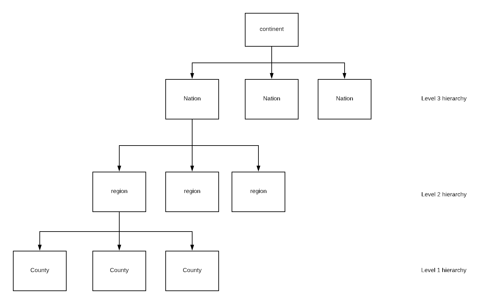

```{r setup, include=FALSE}
knitr::opts_chunk$set(echo = FALSE)
knitr::opts_chunk$set(cache = TRUE)
knitr::opts_chunk$set(message=FALSE)
knitr::opts_chunk$set(warning = FALSE)
library(tidyverse)
library(gridExtra)
library(mlmRev)
library(GGally)
library(rstanarm)
library(bayesplot) 
library(loo)
library(caret)
library(rstan)
library(knitr)
library(loo)

data = Mmmec
set.seed(pi)
#recompute stan models?
recompute=FALSE


#function for loo from stan model
custom_loo = function(fitted_stan_model){
  log_lik_slopes = extract_log_lik(fitted_stan_model)
  loo_slopes <- loo(log_lik_slopes)
  return(loo_slopes)
}

```
# Project aim and description
In this project I studied the relationship between __UVB dose__ and __melanoma mortality rate__, using a __hierarchical__ model to account for the multilevel grouping of the data.
Additionaly a comparison with the following paper has been performed:
<blockquote>
<p>Langford, I.H., Bentham, G. and McDonald, A. (1998). Multilevel modelling of geographically aggregated health data: a case study on malignant melanoma mortality and UV exposure in the European community. <em>Statistics in Medicine</em>, <em>17</em>, 41-58.</p>
</blockquote>

[Link to the paper](https://onlinelibrary.wiley.com/doi/abs/10.1002/%28SICI%291097-0258%2819980115%2917%3A1%3C41%3A%3AAID-SIM712%3E3.0.CO%3B2-0)

# Dataset description

This dataset describes the mortality rate of malignent melanoma in eight European countries.
The reference of the R package is the following: 

[mmmec library](https://www.rdocumentation.org/packages/R2MLwiN/versions/0.8-6/topics/mmmec)


## Variables
There is a total of six variables and 354 observations:
<ul>
<li><code>nation</code> a factor with levels <code>Belgium</code>, <code>W.Germany</code>, <code>Denmark</code>, <code>France</code>, <code>UK</code>, <code>Italy</code>, <code>Ireland</code>, <code>Luxembourg</code>, and <code>Netherlands</code></li>
<li><code>region</code> Region ID - a factor</li>
<li><code>county</code> County ID - a factor</li>
<li><code>deaths</code> Number of male deaths due to malignant melanoma during 1971-1980*</li>
<li><code>expected</code> Number of expected deaths (proportional to population)</li>
<li><code>uvb</code> Centered measure of the UVB dose reaching the earth’s surface in each county.**</li>
</ul>

```* for the United Kingdom,
Ireland, Germany, Italy and The Netherlands, data were only available from 1975—1976 onwards.
This information is not present in the package documentation but only in the paper```

```** in the paper the measure is not centered```

The data are __geographically nested__, since nations are divided in regions, and regions are divided in counties. 
A county is the smallest area forwich we have data.


## Hierarchy

And relative counts:
```{r counting elements}
nesting=data%>%group_by(nation)%>%summarise(regions=n_distinct(region),counties=n_distinct(county))
nesting$number = 1:nrow(nesting) 
kable(nesting%>%select(number,everything()),caption = "Data hierarchy",digits = 2)
```

As we can see the groupings are very eterogenious between nations.

# Explorative data analysis

Let's check the distributions of the variables in the dataset.
```{r descriptive statistics for centered UVB variable }


p1 = ggplot(data,aes(x=nation,y=uvb))+
  geom_boxplot()+
  ggtitle("Uvb by nation")+
  theme(axis.text.x = element_text(angle = 90, hjust = 1))

p2 = ggplot(data,aes(x=nation,y=deaths))+
  geom_boxplot()+
  ggtitle("Deaths by nation")+
  theme(axis.text.x = element_text(angle = 90, hjust = 1))

grid.arrange(p1, p2, ncol=2)

ggplot(data,aes(x=deaths))+
  geom_histogram()+
  #facet_grid(nation ~ .)+
  ggtitle("Deaths count")

kable(data%>%group_by(nation)%>%summarise(N=n(),mean=mean(uvb),sd = sd(uvb),min=min(uvb),max=max(uvb)),caption="Descriptive statistics for UVB",digits = 2)
```

As we can see from a comparison with Table 3 of the paper the values are not the same, since they used a non centered parametrization.


## Correlation plots
```{r correlation}
dataReduced = data %>%select(-c(nation,region,county))
ggpairs( dataReduced ) 
```

There is no linear relation between deaths and uvb.

# Modelling

## Goals
The model proposed is a __double nested negative binomial model__, two models are presented: model A and model B, they reflect the models of the paper but with a negative binomial instead of a Poisson distribution.
The nesting is performed on nations, and for every nation on the regions.

The model focus on two aspects:

- investigate the importance of nested nature of the data (both for model accuracy and variance analysis)

- investigate the relation between UVB dose and mortality rate

## model A:
$$deaths_{ijk}=NB(ln(O_{ijk}),\phi)$$
$$ln(O_{ijk}) = ln(E_{ijk})+\alpha+\beta*UVB_{ijk} +s_k+u_{jk}+e_{ijk}$$
$$s_k\sim N(0,\sigma^2_{s}) $$
$$u_{jk}\sim N(0,\sigma^2_{u}) $$

## model B:

$$ln(O_{ijk}) = ln(E_{ijk})+\alpha+\beta*UVB_{ijk} +s_k +$$
$$ + t_k*UVB_{ijk} + u_{jk} + v_{jk}*UVB_{ijk} + e_{ijk})$$
$$s_k\sim N(0,\sigma^2_{s}) $$

$$t_{k}\sim N(0,\sigma^2_{t}) $$

$$u_{jk}\sim N(0,\sigma^2_{u}) $$
$$v_{jk}\sim N(0,\sigma^2_{v}) $$

explanation of the symbols:

- $i$ represents a county, $j$ represents a region and $k$ represents a nation.
- $E_{ijk}$ is the exposure given in the dataset
- $s_k$,$t_k$  the variations at national level
- $u_{jk}$,$v_{jk}$are  the variations at regional level nested in nations
- $e_{ijk}$ is the randdom variation at county level


## Stan code used for model B:
The model has been runned using 4 chains, a warmup period of 2000 and 4000 iterations, leaving other parameters as default ones.
To replicate the results compile this same Rmd file changing setting <code>recompute=TRUE</code> in the setup section.
```{r model implementation}
modelB_priors=readRDS("models/modelB_priors.stanModel")
code <- get_stancode(modelB_priors)
cat(code)
a=1
```


```{r model computations}
#import models
modelA=readRDS("models/modelA.stanModel")
modelB=readRDS("models/modelB.stanModel")
modelB_priors=readRDS("models/modelB_priors.stanModel")


if(recompute){
  #preparing data transforming factors in integers
  data2=data
  groupingL3=data$nation
  groupingL2=data$region
  groupingL1=data$county
  data2$region_id = as.integer(factor(data$region, levels = unique(data$region)))
  data2$nation_id = as.integer(factor(data$nation, levels = unique(data$nation)))
  nationLookupVec <- as.integer(unique(data2[c("region","nation")])[,"nation"])

  stan_data =
    with(data2,
         list(
              N = length(deaths),
              L = length(unique(groupingL2)),
              J = length(unique(groupingL3)),
              deaths = deaths,
              uvb = uvb,
              population = log(expected),
              region_id = region_id,
              nation_id = nation_id,
              nationWithinRegion = nationLookupVec 
              )
         )
  model_b_stan_priors = rstan::stan_model("models/modelB_priors.stan")
  fitted_b_stan_priors <- rstan::sampling(model_b_stan_priors,
                                   data = stan_data,
                                   chains = 4, 
                                   cores = 4,
                                   iter = 4000, 
                                   control = list(adapt_delta = 0.80, max_treedepth=10),verbose=TRUE,seed=4)

  modelB_priors=fitted_b_stan_priors
  saveRDS(modelB_priors,"models/modelB_priors.stanModel")
  
   model_b_stan = rstan::stan_model("models/modelB.stan")
  fitted_b_stan <- rstan::sampling(model_b_stan,
                                   data = stan_data,
                                   chains = 4, 
                                   cores = 4,
                                   iter = 4000, 
                                   control = list(adapt_delta = 0.80, max_treedepth=10),verbose=TRUE,seed=4)

  modelB=fitted_b_stan
  saveRDS(modelB,"models/modelB.stanModel")
  
    model_a_stan = rstan::stan_model("models/modelA.stan")
  fitted_a_stan <- rstan::sampling(model_a_stan,
                                   data = stan_data,
                                   chains = 4, 
                                   cores = 4,
                                   iter = 4000, 
                                   control = list(adapt_delta = 0.80, max_treedepth=10),verbose=TRUE,seed=4)

  modelA=fitted_a_stan
  saveRDS(modelA,"models/modelA.stanModel")
  
}


```


## Model checking

### Residuals

```{r residuals}

#std residuals modelA

#modelA
y_rep = as.matrix(modelA, pars = "y_rep")
y_rep_values = y_rep[1:length(data$deaths),]
mean_inv_phi <- mean(as.matrix(modelA, pars = "inv_phi"))
mean_y_rep <- colMeans(y_rep)
std_resid <- (data$deaths - mean_y_rep) / sqrt(mean_y_rep + mean_y_rep^2*mean_inv_phi)
plotData=data.frame(data,std_resid,mean_y_rep)
ggplot(plotData,aes(x=mean_y_rep,y=std_resid,color=nation))+
  geom_point()+
  geom_hline(yintercept = 2,color="red")+
  geom_hline(yintercept = -2,color = "red")+
  geom_hline(yintercept = 3,color="green")+
  geom_hline(yintercept = -3,color = "green")+
  ggtitle("Std residuals for model A ")

#modelB
y_rep = as.matrix(modelB, pars = "y_rep")
y_rep_values = y_rep[1:length(data$deaths),]
mean_inv_phi <- mean(as.matrix(modelB, pars = "inv_phi"))
mean_y_rep <- colMeans(y_rep)
std_resid <- (data$deaths - mean_y_rep) / sqrt(mean_y_rep + mean_y_rep^2*mean_inv_phi)
plotData=data.frame(data,std_resid,mean_y_rep)
ggplot(plotData,aes(x=mean_y_rep,y=std_resid,color=nation))+
  geom_point()+
  geom_hline(yintercept = 2,color="red")+
  geom_hline(yintercept = -2,color = "red")+
  geom_hline(yintercept = 3,color="green")+
  geom_hline(yintercept = -3,color = "green")+
  ggtitle("Std residuals for model B ")


```

### Model comparison
- model1 mathces modelA, 
- model2 matches modelB with non informative priors 
- model3 matches modelB with custom priors, selected in such a way to shorten the tails of posteriors distributions
```{r model comparisons}
loo_A  = custom_loo(modelA)
loo_B  = custom_loo(modelB)
loo_B_priors  = custom_loo(modelB_priors)
kable(loo_compare(loo_A,loo_B,loo_B_priors),caption = "Loo comparisons",digits = 2) #model B wins

```

### Posterior predictive checks 
As we can check from the following graphs the model fits well the data.
```{r model checking}
ppc_dens_overlay(data$deaths,y_rep_values)+
  ggtitle("Replicated vs real")
y=data$deaths
p1 = ppc_stat(y,y_rep_values,stat="mean")+
  ggtitle("Mean")
p2=ppc_stat(y,y_rep_values,stat="sd")+
  ggtitle("standard deviation")
grid.arrange(p1, p2, ncol=2)

ppc_stat_grouped(y,y_rep_values,group=data$nation,stat="mean")+
  ggtitle("Nations means comparison")
ppc_stat_grouped(y,y_rep_values,group=data$nation,stat="sd")+
  ggtitle("Nations sd comparison")
ppc_stat_grouped(y,y_rep_values,group=data$nation,stat="min")+
  ggtitle("Nations min comparison")
ppc_stat_grouped(y,y_rep_values,group=data$nation,stat="max")+
  ggtitle("Nations max comparison")

p1=ppc_ecdf_overlay(y,y_rep)+
  ggtitle("Empirical distribution function")
p2=ppc_intervals(y,y_rep)+
  ggtitle("Intervals")
grid.arrange(p1, p2, ncol=2)


```

## Model inferences

### Parameters

The estimated parameters are graphically shown in the next plots: 
The fixed therms are both compatible with 0, so are the region level ones.
From the last plot it is clear that the relation between UVB index and death rates shows large variations between countries, in fact for __UK__, __Ireland__, __Belgium__, __France__, __Luxemburg__ we have a positive relation,  instead for __W.Germany__, __Denmark__, __Italy__, __Netherland__ a negative one.
This fact alone shows that in this kind of analysis taking into account the hierarchical nature of data is of paramount importance.

```{r fixed inferences paramas}

fit_A = as.matrix(modelA)
p1=mcmc_areas(fit_A,pars = c("alpha","beta"))+
  ggtitle("Fixed therms model A")
 
 
fit_B = as.matrix(modelB_priors)
 p2=mcmc_areas(fit_B,pars = c("alpha","beta"))+
  ggtitle("Fixed therms model B")
 
grid.arrange(p1, p2, ncol=2)
```

```{r national level inferences}
p2 = mcmc_areas(fit_B,regex_pars = "^beta_nat")+
  ggtitle("Beta at national level")
p1 =mcmc_areas(fit_B,regex_pars = "^alpha_nat")+
  ggtitle("Alpha at national level")
grid.arrange(p1, p2, ncol=2)
```

```{r regional level inferences}
p1 = mcmc_intervals(fit_B,regex_pars = "^dev_reg")+
  ggtitle("Alpha at regional level")
p2 = mcmc_intervals(fit_B,regex_pars = "^dev_beta_reg")+
  ggtitle("Beta at regional level")
grid.arrange(p1, p2, ncol=2)

```

```{r computed values}
list_of_draws=extract(modelB_priors)
dev=data.frame(
  alpha=mean(list_of_draws$alpha),
  alpha_sd=sd(list_of_draws$alpha),
  beta=mean(list_of_draws$beta),
  beta_sd=sd(list_of_draws$beta),
  sigma_nat=mean(list_of_draws$sigma_nat),
  sigma_nat_sd=sd(list_of_draws$sigma_nat),
  sigma_reg=mean(list_of_draws$sigma_reg),
  sigma_reg_sd=sd(list_of_draws$sigma_reg),
  sigma_beta_reg=mean(list_of_draws$sigma_beta_reg),
  sigma_beta_reg_sd=sd(list_of_draws$sigma_beta_reg),
  sigma_beta_nat=mean(list_of_draws$sigma_beta_nat),
  sigma_beta_nat_sd=sd(list_of_draws$sigma_beta_nat),
  cor_sigma_nat_beta = cor(list_of_draws$sigma_nat,list_of_draws$sigma_beta_nat),
  cor_sigma_reg_beta = cor(list_of_draws$sigma_reg,list_of_draws$sigma_beta_reg),
  var_nat=mean(list_of_draws$var_nat),
  var_reg=mean(list_of_draws$var_reg),
  var_nat_sigma=sd(list_of_draws$var_nat),
  var_reg_sigma=sd(list_of_draws$var_reg)
 
) 


#correlationss
#kable(cor(list_of_draws$sigma_nat,list_of_draws$sigma_beta_nat))
#kable(cor(list_of_draws$sigma_reg,list_of_draws$sigma_beta_reg))
#beta_nat
#colMeans(list_of_draws$beta_nat)
#apply(list_of_draws$beta_nat,2,sd)

```


### Variance
```{r inferences variance }
#posterior checks model A
if(FALSE){
  fit_A = as.matrix(modelA)
  paper_results=data.frame(var_nat=0.105,var_reg=0.0147)
  mcmc_areas(fit_A,regex_pars = "var",prob = 0.95)+
    geom_vline(data = paper_results, xintercept = paper_results$var_nat ,color="green")+
    geom_vline(data = paper_results, xintercept = paper_results$var_reg,color="red")+
    annotate("text", x = paper_results$var_nat, y = 1.5, label = "var_nat paper")+
    annotate("text", x = paper_results$var_reg, y = 1.8, label = "var_reg paper")
  
  mcmc_intervals(fit_A,pars = "alpha")
  mcmc_intervals(fit_A,regex_pars = "sigma")
  mcmc_intervals(fit_A,regex_pars = "^alpha_nat")
  mcmc_intervals(fit_A,regex_pars = "^alpha_reg")
  
  list_of_draws=extract(modelA)
  dev=data.frame(
    alpha=mean(list_of_draws$alpha),
    alpha_sd=sd(list_of_draws$alpha),
    beta=mean(list_of_draws$beta),
    beta_sd=sd(list_of_draws$beta),
    sigma_nat=mean(list_of_draws$sigma_nat),
    sigma_nat_sd=sd(list_of_draws$sigma_nat),
    sigma_reg=mean(list_of_draws$sigma_reg),
    sigma_reg_sd=sd(list_of_draws$sigma_reg)
  )
  
  modelA_pars = dev 
}

#posterior checks model B 

paper_results=data.frame(var_nat=0.105,var_reg=0.0147)
mcmc_areas(fit_B,regex_pars = "var",prob = 0.95)+
  geom_vline(data = paper_results, xintercept = paper_results$var_nat ,color="green")+
  geom_vline(data = paper_results, xintercept = paper_results$var_reg,color="red")+
  annotate("text", x = paper_results$var_nat, y = 1.5, label = "var_nat paper")+
  annotate("text", x = paper_results$var_reg, y = 1.8, label = "var_reg paper")+
  ggtitle("Variance components")


#priors
x = seq(0,1, length=100)
y=dgamma(x, 10, 30)
df=data.frame(x,y)
p2=ggplot(df,aes(x=x,y=y))+
  geom_line()+
  ggtitle("Used prior (Gamma(10,30))")


p1=mcmc_areas(fit_B,regex_pars = "sigma")+
  ggtitle("Standard deviations")
grid.arrange(p1, p2, ncol=2)

```


# Comparison with paper

###Parameters

```{r compare with paper results}
paper=data.frame(parameter=c("alpha","beta","var_nat","var_reg","cor_nat","cor_reg","var_nat_beta","var_reg_beta"),
                 modelA_mean=c(0.0103,-0.0360,0.140,0.0424,NaN,NaN,NaN,NaN),
                 modelA_sd=c(0.134,0.0107,0.0733,0.00956,NaN,NaN,NaN,NaN),
                 modelB_mean=c(0.189,0.00435,0.105,0.0147,0.00540,-0.00336,0.00486,0.000745),
                 modelB_sd=c(0.143,0.0329,0.0746,0.00498,0.00123,0.000938,0.00368,0.000252))
table_5_paper=data.frame(nation=unique(data$nation),
                         estimate = c(0.0244,-0.0133,-0.0706,-0.0010,0.0770,-0.0481,0.0243,0.0048,0.0005),
                         sd=c(0.0626,0.0441,0.0715,0.0394,0.0486,0.0398,0.0583,0.0618,0.0557))

modelA_estimates = summary(modelA,pars=c("alpha","beta","var_nat","var_reg"))$summary
modelA_estimates = data.frame(parameter = rownames(modelA_estimates),modelA_estimates)
modelB_estimates = summary(modelB_priors,pars=c("alpha","beta","var_nat","var_reg"))$summary
modelB_estimates = data.frame(parameter = rownames(modelB_estimates),modelB_estimates)
modelB_beta_estimates = summary(modelB_priors,pars=c("beta_nat"))$summary
modelB_beta_estimates = data.frame(nation = unique(data$nation),modelB_beta_estimates)

joinA = inner_join(paper,modelA_estimates,by="parameter")
joinB = inner_join(paper,modelB_estimates,by="parameter")
joinBeta =inner_join(table_5_paper,modelB_beta_estimates,by="nation")

#kable(joinA%>%filter(modelA_mean>X25. && modelA_mean<X75.),caption = "Model A values between 25 and 75 percentiles")
kable(joinB%>%filter(modelB_mean>X25. && modelB_mean<X75.),caption = "Model B values between 25 and 75 percentiles",digits = 2)
kable(joinBeta%>%mutate(delta_sd=(sd.y-sd.x)/sd.x*100)%>%
  arrange(delta_sd)%>%filter(estimate>X2.5. && estimate<X97.5.),caption = "Beta pooled values between 2.5 and 97.5 percentiles",digits = 2)


#figure 2 
fit=modelB_priors
#retrive parameters of interest (sd)
list_of_draws=extract(fit)
sigma_nat=mean(list_of_draws$sigma_nat)
sigma_nat_sd=sd(list_of_draws$sigma_nat)
sigma_reg=mean(list_of_draws$sigma_reg)
sigma_reg_sd=sd(list_of_draws$sigma_reg)
sigma_beta_reg=mean(list_of_draws$sigma_beta_reg)
sigma_beta_reg_sd=sd(list_of_draws$sigma_beta_reg)
sigma_beta_nat=mean(list_of_draws$sigma_beta_nat)
sigma_beta_nat_sd=sd(list_of_draws$sigma_beta_nat)
#fitted parameters
alpha=mean(list_of_draws$alpha)
beta=mean(list_of_draws$beta)
#variations on nation level
beta_nat=colMeans(list_of_draws$beta_nat)
beta_nat_sd = apply(list_of_draws$beta_nat, 2, sd)
alpha_nat=colMeans(list_of_draws$alpha_nat)
alpha_nat_sd = apply(list_of_draws$alpha_nat, 2, sd)
#rate
eta = colMeans(list_of_draws$eta_rep)
#putting all together
coeff = data.frame(nation=unique(data$nation),beta=beta_nat,beta_nat_sd,alpha = alpha_nat,alpha_nat_sd)
#plot figure 2
#plot slopes
ggplot(data=data,aes(x=uvb,y=log(eta),color=nation))+
  #geom_point()+
  geom_abline(data=coeff,aes(slope= beta,intercept=alpha,colour=nation))+
  ylim(-1,1)+
  xlim(-9,15)+
  ggtitle("Random slopes and intercepts like in figure 1")


```


###Variance

```{r variance paper vs model}
list_of_draws=extract(modelB_priors)
dev=data.frame(
  alpha=mean(list_of_draws$alpha),
  alpha_sd=sd(list_of_draws$alpha),
  beta=mean(list_of_draws$beta),
  beta_sd=sd(list_of_draws$beta),
  sigma_nat=mean(list_of_draws$sigma_nat),
  sigma_nat_sd=sd(list_of_draws$sigma_nat),
  sigma_reg=mean(list_of_draws$sigma_reg),
  sigma_reg_sd=sd(list_of_draws$sigma_reg),
  sigma_beta_reg=mean(list_of_draws$sigma_beta_reg),
  sigma_beta_reg_sd=sd(list_of_draws$sigma_beta_reg),
  sigma_beta_nat=mean(list_of_draws$sigma_beta_nat),
  sigma_beta_nat_sd=sd(list_of_draws$sigma_beta_nat),
  cor_sigma_nat_beta = cor(list_of_draws$sigma_nat,list_of_draws$sigma_beta_nat),
  cor_sigma_reg_beta = cor(list_of_draws$sigma_reg,list_of_draws$sigma_beta_reg),
  var_nat=mean(list_of_draws$var_nat),
  var_reg=mean(list_of_draws$var_reg),
  var_nat_sigma=sd(list_of_draws$var_nat),
  var_reg_sigma=sd(list_of_draws$var_reg)
 
) 
modelB_pars = dev 
#modelB_pars$var_nat
#modelB_pars$var_nat_sigma
#modelB_pars$var_reg
#modelB_pars$var_reg_sigma
paper_var_nat = 0.140
paper_var_nat_sd=0.0733

paper_var_reg = 0.0424
paper_var_reg_sd=0.00956

variances=data.frame(
  
  parameter=c("variance_national","variance_regional"),
  
  paper_estimate=c(paper_var_nat, paper_var_reg),
  
  paper_se=c(paper_var_nat_sd, paper_var_reg_sd),

  modelB_estimate=c(modelB_pars$var_nat,modelB_pars$var_reg),
  
  modelB_sd=c(modelB_pars$var_nat_sigma, modelB_pars$var_reg_sigma)
  
  )
kable(variances,digits = 2)
```


## Conclusions

- The obtained results are compatible with those from the paper.

- There is a relationship between UVB exposure and death rates but it is highly dependent on the nation.

- The variance is much higher at national level, than between regions of the same nation.

- Taking into account the hierarchical nature of data is of vital importance here, for example model A shows a spurious  negative correlation hxpoure and mortality rate, but this correlation disappears in model B.

- It would be interesting to have more explanatory variables, and to have the mapping between regions/counties and their physical location, unfortunately I was not able to find this information anywhere, and the original cancer atlas from where data are taken is not aviable anywhere on the net.


## Additional notes

- I tried to do a pull request on the GitHub page of the package to fix the information about the dataset, but the GitHub page appears to be only a read-only mirror. 


- Some fitted models exceeded the maximum size allowed by GitHub (100 Mb) and committing them blocked my work, I had to revert all my local changes to fix the problem, so take care committing compiling models.

## Appendix

Here I list all the computed parameters for model B

```{r all the parameters}
kable(summary(modelB_priors,pars=c("alpha"))$summary,digits = 2)
kable(summary(modelB_priors,pars=c("beta"))$summary,digits = 2)
kable(summary(modelB_priors,pars=c("beta_nat"))$summary,digits = 2)
kable(summary(modelB_priors,pars=c("alpha_nat"))$summary,digits = 2)
kable(summary(modelB_priors,pars=c("beta_reg"))$summary,digits = 2)
kable(summary(modelB_priors,pars=c("alpha_reg"))$summary,digits = 2)

```